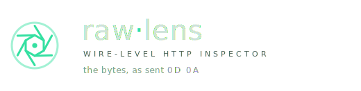

<p align="center">
  
</p>

# raw-lens

抓 HTTP 请求的**原始字节**——header 的顺序、大小写、重复项，以及 body，全部保真展示。

普通 HTTP 框架（Go `net/http`、Flask、Express）都会把 header 规范化：首字母大写、排序、合并重复项。
raw-lens 不走框架，直接监听裸 TCP，自己读 socket 字节、自己找 header 边界、按 `Content-Length` / `Transfer-Encoding: chunked` 读 body，所以你看到的就是客户端真正发出来的样子。

## 两个端口

| 端口 | 用途 |
|------|------|
| `:9100`（抓包） | **对外暴露这个**。客户端把请求发到这里，会被原样记录，并回一个最小的 `200`。 |
| `:9101`（面板） | 浏览器打开 `http://<host>:9101` 看抓到的请求。不要对公网暴露。 |

两个端口分开，是为了让你打开面板页面本身的请求不会污染抓包列表。

## 本地开发

```bash
mise run install      # 安装全部依赖（go mod download + pnpm install）
```

然后开**两个终端**：

```bash
# 终端 1：后端（监听 :9100 抓包、:9101 面板 API）
mise run api

# 终端 2：Vite 开发服务器（HMR，/api 代理到 :9101）
mise run webui
# 然后浏览器开 http://localhost:5173
```

向抓包端口发请求测试：

```bash
curl -X POST localhost:9100/hi -d 'hello'
```

## 配置

所有运行时配置走 `config.yaml`（启动时默认读当前目录的 `config.yaml`，或用 `-config /path/to.yaml` 指定）。文件不存在时使用内置默认值，只需写你想改的字段。仓库提供 `config.example.yaml` 模板，复制一份再按需修改即可：`cp config.example.yaml config.yaml`。

```yaml
capture:
  addr: ":9100"        # 裸 TCP 抓包监听地址，对外暴露这个端口
  tls:
    enabled: false     # 开启后抓包端口走 TLS，可抓 HTTPS 原始请求
    cert: ""           # 证书路径；留空则用内存自签名证书
    key: ""            # 私钥路径
dashboard:
  addr: ":9101"        # 前端面板监听地址，建议只在内网/本机访问
store:
  max: 500             # 最多保留多少条请求（超出删最旧）
  mode: SQLITE         # 存储模式：SQLITE=落盘到默认文件 data/db/rawlens.db；MEMORY=内存库（重启即清空）
log:
  file: "data/logs/rawlens.log"  # 日志文件；留空 "" 则只输出到 stdout
  max_size_mb: 10                # 单文件超过多少 MB 滚动
  max_backups: 5                 # 最多保留多少个滚动备份
  max_age_days: 14               # 备份最多保留多少天
```

`-config` 是唯一的命令行 flag。`store.mode` 默认 `SQLITE`，请求落盘到 `data/db/rawlens.db` 持久化、进程重启后记录不丢失；配成 `MEMORY` 则用内存库、重启即清空。日志始终打到 stdout（`docker logs` 可见）；`log.file` 非空时再额外写一份到该文件并用 lumberjack 按大小滚动，配空字符串则只走 stdout。db 与日志都落在 `data/` 子目录下（`data/db`、`data/logs`），本地 dev 与容器一致，不会散落在启动目录根上。

## 抓 HTTPS 原始请求

在 `config.yaml` 里把 `capture.tls.enabled` 设为 `true`。TLS 握手由 raw-lens 终结，握手后读到的是**解密后的明文字节**——和抓 HTTP 一样保真（顺序、大小写、重复 header 全保留）。

```yaml
capture:
  tls:
    enabled: true
    cert: ""   # 留空 = 内存自签名证书（测试用，客户端需 curl -k）
    # cert: /etc/letsencrypt/live/example.com/fullchain.pem   # 或用真证书
    # key:  /etc/letsencrypt/live/example.com/privkey.pem
```

```bash
mise run api                                   # 按上面的 config.yaml 启动后端
curl -k https://localhost:9100/secure -d hi    # -k 跳过自签名校验
```

`cert`/`key` 留空时自动生成一张内存自签名证书（含 `localhost` / `127.0.0.1`），仅供测试。客户端会报证书不可信，用 `curl -k` 或浏览器手动信任即可。

## 部署

本项目**只支持 Docker 部署**。镜像发布在 GHCR：`ghcr.io/yuebai-blast/raw-lens`（推送 `vX.Y.Z` tag 时由 CI 构建 `linux/amd64,linux/arm64` 多架构镜像）。

**推荐用仓库自带的 `docker-compose.yml`**（面板端口绑本机回环，配置与数据都落在 compose 同目录的 bind mount，便于备份/迁移）。把 compose 放进一个专属目录后，在该目录执行：

```bash
cp config.example.yaml config.yaml   # 准备配置
mkdir -p data                        # 建数据目录（db/ logs/ 子目录由程序自动创建）
docker compose up -d
```

容器内 `WORKDIR=/app`，挂载关系：宿主 `./config.yaml` → `/app/config.yaml`（默认读取位置）、宿主 `./data` → `/app/data`。运行后：

```
your-dir/
├── docker-compose.yml
├── config.yaml
└── data/
    ├── db/rawlens.db        # SQLite 抓包库
    └── logs/rawlens.log     # 日志（+ 滚动备份）
```

不想用 compose 也可手动 `docker run`：

```bash
docker run --rm \
  -p 9100:9100 -p 9101:9101 \
  -v "$(pwd)/config.yaml:/app/config.yaml:ro" \
  -v "$(pwd)/data:/app/data" \
  ghcr.io/yuebai-blast/raw-lens:latest
```

- 镜像以 **root** 运行（普通 `debian-slim` 底座），能直接写 bind 挂载进来的 `./data`，**无需 chown、无需指定 `user`**。代价：`./data` 下生成的文件在宿主上归 root，删除/编辑可能要 `sudo`。
- 默认无 `config.yaml` 时使用内置默认值。
- 抓包端口 9100 对外放开给客户端；面板端口 9101 建议只在本机/内网访问（如用 SSH 隧道 `ssh -L 9101:localhost:9101 user@server`，或只把 9100 映射到宿主公网）。
- 查看日志：`docker compose logs -f rawlens`（stdout）；长期历史看 `./data/logs/` 下的文件。
- 本地构建验证：`mise run image`（构建单架构 `rawlens:local`）。

> 首次发布后镜像在 GitHub Packages 默认 private，如需公开拉取，到仓库 Packages 设置里改为 public。

## 目录结构

标准 Go 布局，前后端分离：

```
config.example.yaml          运行时配置模板（端口 / TLS / 容量），复制为 config.yaml 后编辑
cmd/rawlens/main.go          入口：加载配置、起两个 server
internal/
  config/config.go           YAML 配置加载（默认值 + 文件覆盖）
  store/store.go             SQLite 持久化存储 + CapturedRequest 类型
  capture/capture.go         裸 TCP 抓包 + 原始解析（保真的核心）
  capture/tls.go             TLS 配置 / 自签名证书生成
  dashboard/dashboard.go     面板 JSON API + SPA fallback
frontend/                    前端源码（Vue 3 + TS + Vite + Pinia + Router）
  src/                       App.vue、router、stores、components、views、utils
web/
  embed.go                   //go:embed all:dist，把 dist/ 编进二进制
  dist/                      pnpm build 产物（gitignored，dist/.keep 已提交）
```

后端依赖方向：`capture → store`、`dashboard → store, web`、`main → config + 三者`。
配置外置（`config.yaml`），前端经 `go:embed` 内嵌——部署只需二进制 + 一个 yaml。

## 已知边界

- 每条连接处理一条请求（响应带 `Connection: close`），不做 keep-alive 复用。curl / 浏览器会自动开新连接，不影响使用。
- chunked body 按原始分块字节保存（含分块框架），保真优先。
- header 上限 1 MiB，超出报错但已收到的字节仍会保存。
